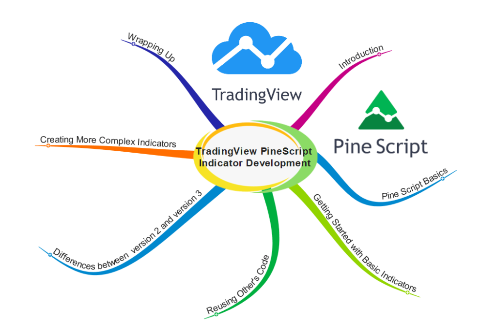
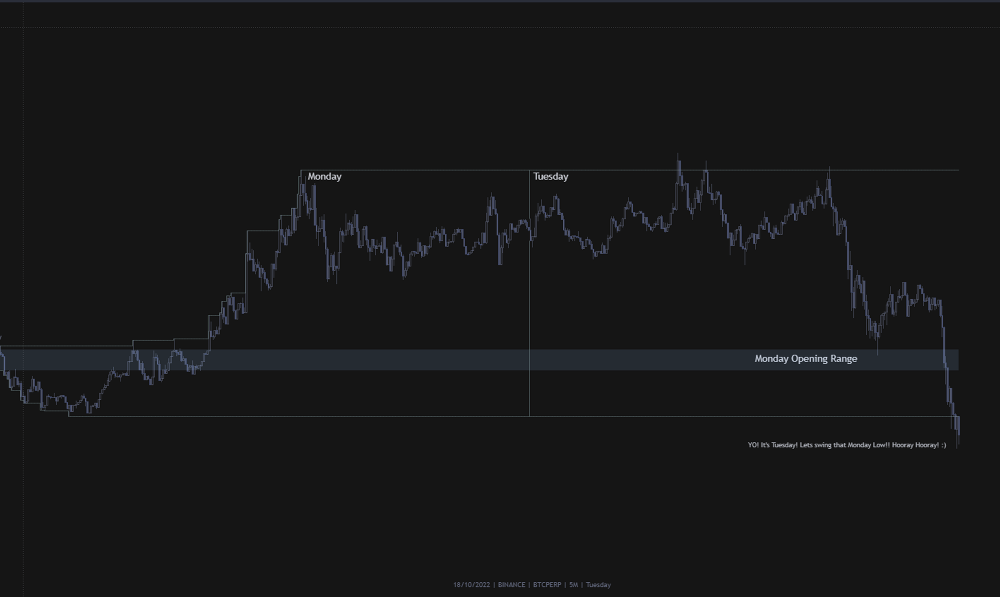
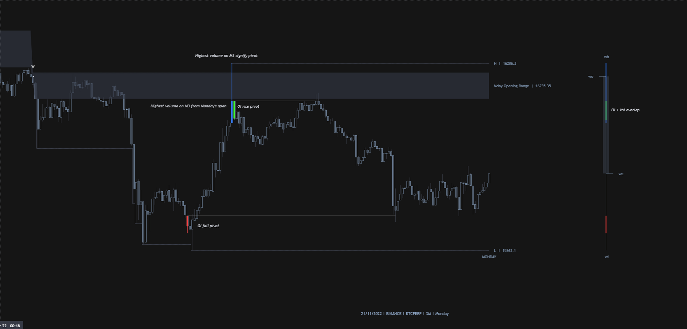
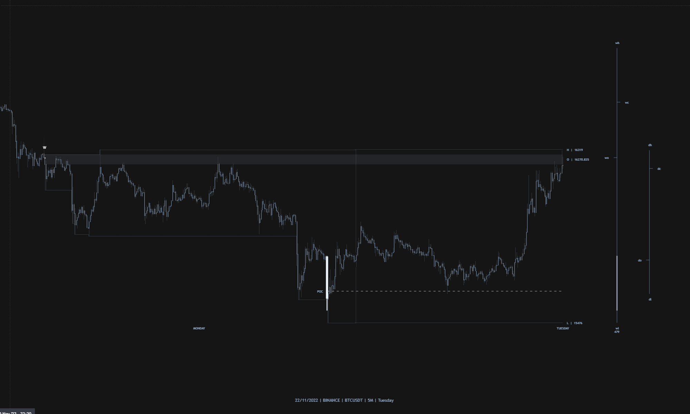
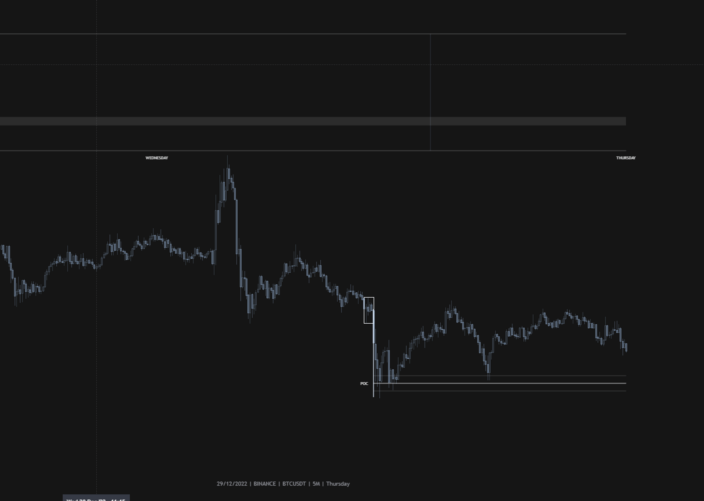

<h2 align="center"> Trading Cloud Indicators and Tools </h2>

  

 The site contains indicators created by Jo Pepin and Vio. The code is intendes as a common framework for testing and developing TradingView Pinescript Indicators. 

# Available Indicators 
 - [Monday Script](#monday-script)	
  - [Monday Script V1](#monday-script-v1)  
  - [Monday Script V2](#monday-script-v2) 
  - [Monday Script V3](#monday-script-v3)  
  - [Monday Script V4](#monday-script-v4) 
  - [Monday Script V5](#monday-script-v5)   

# Monday Script

 ## Monday Script V1 
	
  ### Description
	
    * Locates Mondays and extend through Tuesday. 
	* Shows Opening range and warning when Monday H/L is breached on Tuesday 

  ### Indicator preview	
  

  ### Details and Revisions
	
    * details how to configurate the indicator
    * you will learn how to use this indicator in ordwe to create a basic trading strategy.
    * code snipets designed to show you how the indicator works.
    * Trading View indicator reference	
	
	
    

		 
		&nbsp;
		<a href="doc/jo-pippin/monday_script_v1.md" > <b> More Details ... </b> </a>
	

	
	 
	
	> &#10240;
	>**NOTE:** Please make sure that you review all the versions of this indicator and chose the best one that fets your neds.
	> &#10240;

  ## Monday Script V2
	
   ### Description
	
	* Will run slower as the Lite version and will only work from the M3 up to the M20 as the data gets too much to handle on ltf’s. 
	* Locates Mondays and extend through Tuesday. 
	* Shows Opening range and warning when Monday H/L is breached on Tuesday. 
	* Shows highest % rise and fall in OI from the current week’s open. 
	* Shows max vol since the week started.
	
   ### Indicator preview
   

   ### Details and Revisions
	
    * details how to configurate the indicator
    * you will learn how to use this indicator in ordwe to create a basic trading strategy.
    * code snipets designed to show you how the indicator works.
    * Trading View indicator reference	
	
	
	

		 
		&nbsp;
		<a href="doc/jo-pippin/monday_script_v2.md" > <b> More Details ... </b> </a>
	

	
	 
	
	> &#10240;
	>**NOTE:** Please make sure that you review all the versions of this indicator and chose the best one that fets your neds.
	> &#10240;
	
  ## Monday Script V3
	
   ### Description
	
   * Monday Opening Range, Days of week, Max volume calculated from the weekly start, gives weekly and daily candle, included ltf poc within Max M5-M20 candle. 
	
   ### Indicator preview
	
   

   ### Details and Revisions
	
    * details how to configurate the indicator
    * you will learn how to use this indicator in ordwe to create a basic trading strategy.
    * code snipets designed to show you how the indicator works.
    * Trading View indicator reference	
	
	
	

		 
		&nbsp;
		<a href="doc/jo-pippin/monday_script_v3.md" > <b> More Details ... </b> </a>
	

	
	 
	
	> &#10240;
	>**NOTE:** Please make sure that you review all the versions of this indicator and chose the best one that fets your neds.
	> &#10240;	

  ## Monday Scirpt V4
	
   ### Description
    * introducing alers 
    * Monday Opening Range, Days of week, Max volume calculated from the weekly start, gives weekly and daily candle, included ltf poc within Max M5-M20 candle. 
	
   ### Indicator preview
	
	

   ### Details and Revisions
	
	- details how to configurate the indicator
	- you will learn how to use this indicator in ordwe to create a basic trading strategy.
	- code snipets designed to show you how the indicator works.
	- Trading View indicator reference	
	
	
	

		 
		&nbsp;
		<a href="doc/jo-pippin/monday_script_v4.md" > <b> More Details ... </b> </a>
	

	
	 
	
	> &#10240;
	>**NOTE:** Please make sure that you review all the versions of this indicator and chose the best one that fets your neds.
	> &#10240;	
	
  ## Monday Scirpt V5
	
   ### Description
	
    * Monday Opening Range, Days of week, Max volume calculated from the weekly start, gives weekly and daily candle, included ltf poc within Max M5-M20 candle. 
    * Added alerts and auto trade setup and poc zone with ob.
	
   ### Indicator preview
	
	

   ### Details and Revisions
	
	- details how to configurate the indicator
	- you will learn how to use this indicator in ordwe to create a basic trading strategy.
	- code snipets designed to show you how the indicator works.
	- Trading View indicator reference	
	
	
	

		 
		&nbsp;
		<a href="doc/jo-pippin/monday_script_v5.md" > <b> More Details ... </b> </a>
	

	
	 
	
	> &#10240;
	>**NOTE:** Please make sure that you review all the versions of this indicator and chose the best one that fets your neds.
	> &#10240;	