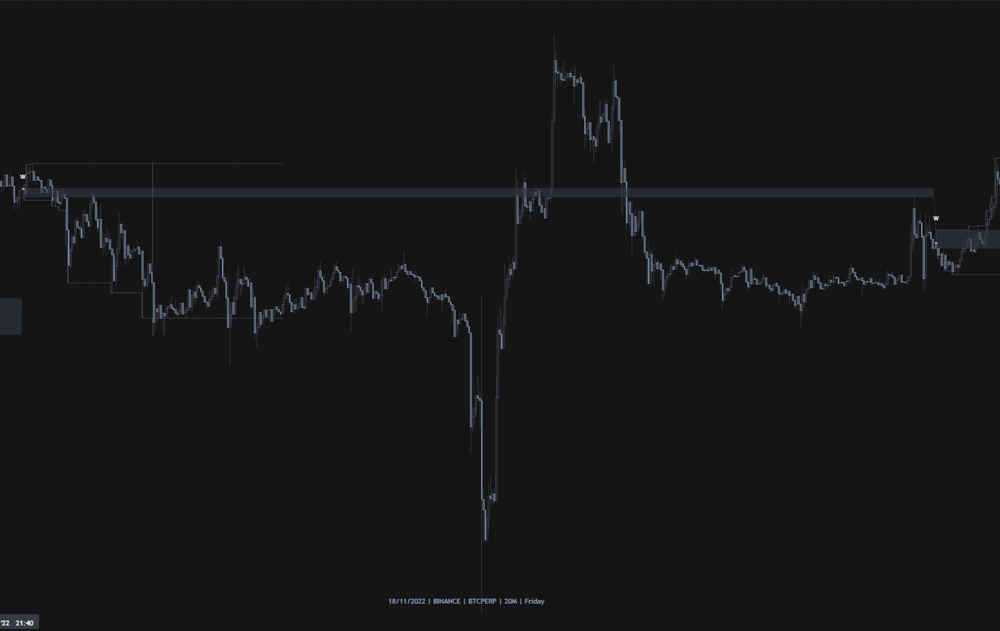
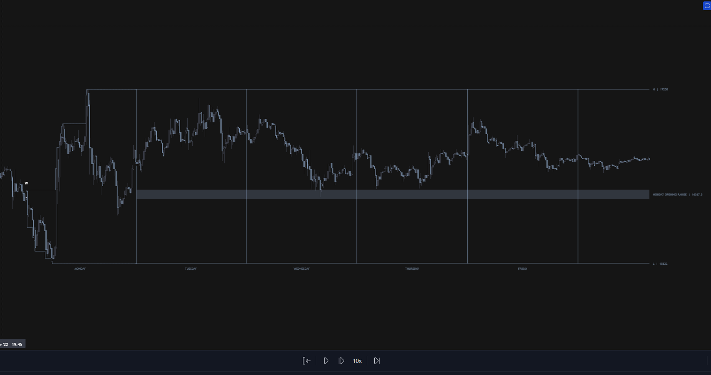
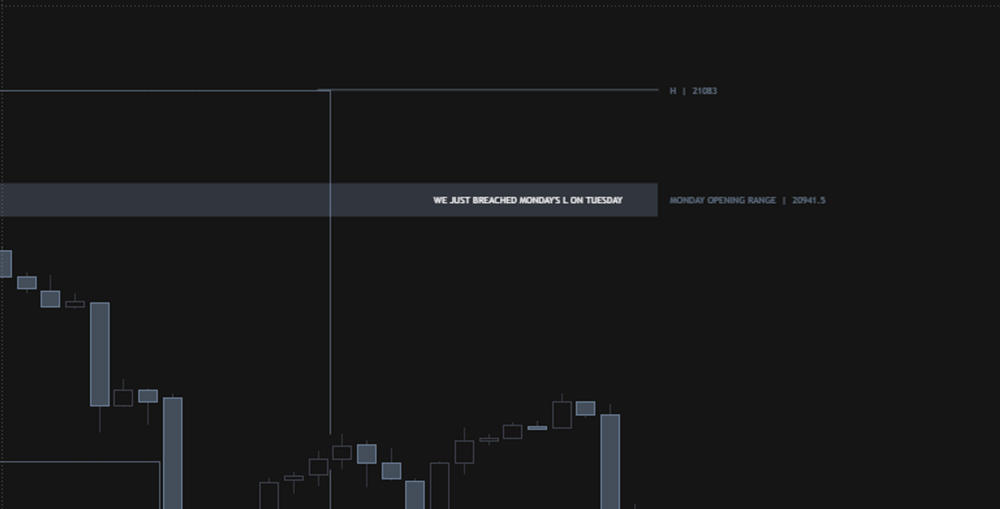

# Summary 
Locates Mondays and extend through Tuesday. Shows Opening range and warning when Monday H/L is breached on Tuesday 

# Indicator overview
* Locates Mondays and extend through Tuesday. 
* Shows Opening range and warning when Monday H/L is breached on Tuesday 


# Updates
- [Update 1](#update1)
- [Update 2](#update2)
- [Update 3](#update3)

## Update 1

added option to extend monday opening range to the end of the week



## Update 2



## Update 3



# Details

    <p align="left">
		 
		&nbsp;
		<a href="./scripts/jo-pippin/monday_script_v1.pine" > <b> More Details ... </b> </a>
	</p>

# Code Snippets

```pine

//Monday Anchored
new_period(p) => p and na(p[1])
sm = time(timeframe.period, "0000-0000:2")
var float c = close[1]

if new_period(sm)
    c := close   
if sm
    c := close

new_period2(p2) => p2 and na(p2[1])
sm2 = time(timeframe.period, "0000-0000:1")
var float c2 = close

if new_period2(sm2)
    c2 := time   
if sm2
    c2 := close     

mon_open_bar = ta.barssince(sm2)
mon_end_bar  = ta.barssince(sm)    

hide_right_oi        = time > sm  ? color.new(color.green, 0)   : color.new(color.yellow, 0) 


line_n = show_Line_B ? line.new(bar_index[mon_open_bar],c2,bar_index[mon_end_bar],c,color=color.new(color.green,100),width = 1, extend = extend.right, style = line.style_dotted):na
line.delete(line_n[1])

kkk = line.get_price(line_n,bar_index[1])

line_n1 = show_Line_B ? line.new(bar_index[mon_end_bar],c,bar_index[1],kkk,color=line_col_theme,width = 1, style = line.style_dotted):na
line.delete(line_n1[1])

[weeklyOpen, prev_weeklyOpen]    = request.security(syminfo.tickerid, 'W',   [open, open[1]], lookahead=barmerge.lookahead_on)

percentage_from_prev_wOpen = (close - prev_weeklyOpen)/prev_weeklyOpen *100
percentage_from_wOpen = (close - weeklyOpen)/weeklyOpen *100
high_low = close > prev_weeklyOpen ? low : close < prev_weeklyOpen ? high :na
fade_color = color.new(#6673a5, 98)
t_color    = color.new(#676d84,0)

percentage_range(value, minimum, maximum) =>
    math.min(math.max(value, minimum), maximum)
	
//////////////// IB Mon-Tue///////////
getIB(session_times) =>
    in_session = time(timeframe.period, session_times)
    var ib_high = 0.0
    var ib_low = 10e10
    if in_session
        if not in_session[1]
            ib_high := high
            ib_low := low
            ib_low
        else
            ib_high := math.max(high, ib_high)
            ib_low := math.min(low, ib_low)
            ib_low
    [in_session, ib_high, ib_low]

[in_day_session, ib_high, ib_low] = getIB(IB_D)

// ALERTS =====================================================================

if  ta.cross(close,monday_high) 
    alert("Price crossed Monday's L/H", alert.freq_once_per_bar)

// if ta.cross(close,ib_high) or ta.cross(close,ib_low)
//     alert("Price crossed Monday's Opening Range", alert.freq_once_per_bar)

```

## Comments and planning