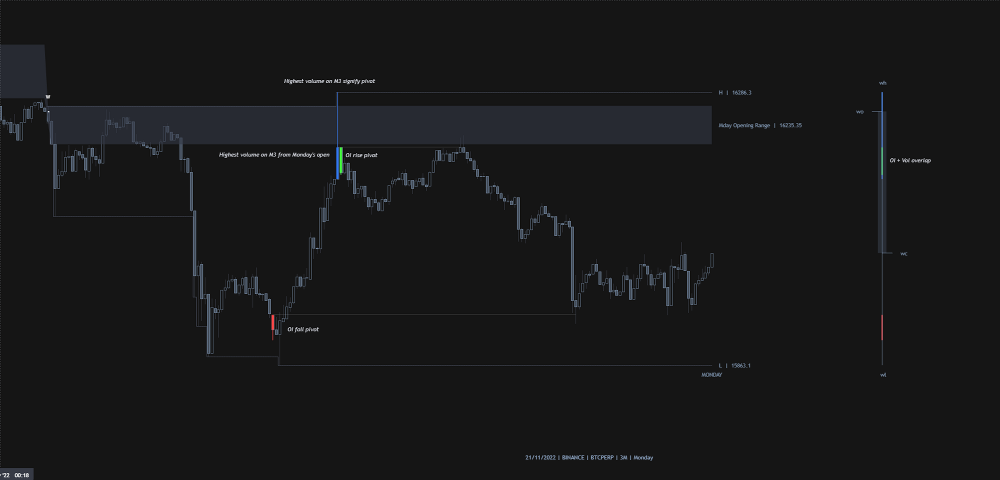
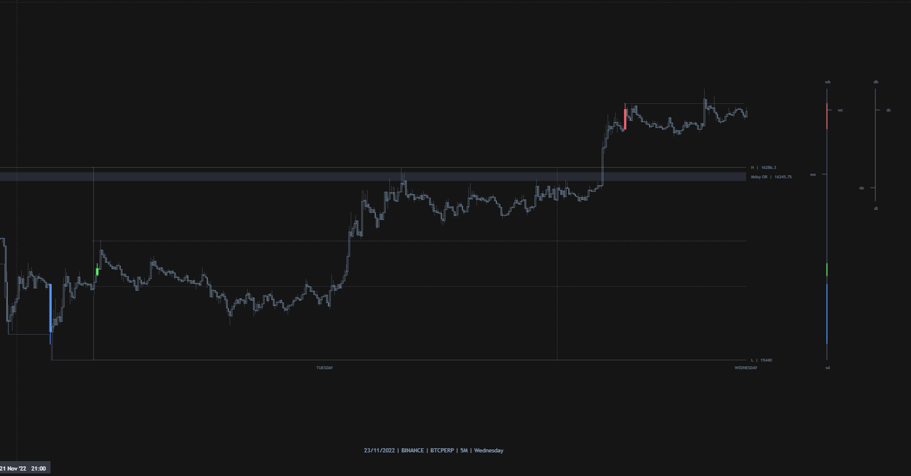
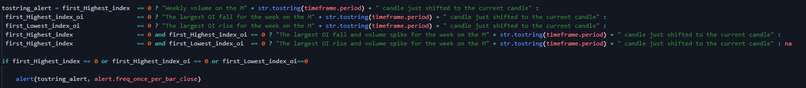
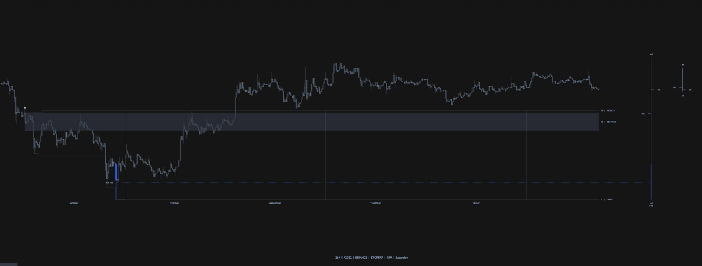

# Description 
- [Description] (#script-description)

# Table of contents
- [Table of contents](#table-of-contents)
  - [Indicator overview](#indicator-overview)
  - [Feature description](#feature-description)
  - [Update](#feature-updates)
  - [Comments and planning](#comments)

## Indicator overview

Will run slower as the Lite version and will only work from the M3 up to the M20 as the data gets too much to handle on ltf’s. Locates Mondays and extend through Tuesday. Shows Opening range and warning when Monday H/L is breached on Tuesday. Shows highest % rise and fall in OI from the current week’s open. Also shows max vol since the week started. Added weekly candle with OI and vol data

## Feature description

## Update
 . To use the alert simply be on the M5 and right click on the indicator and select  “Add alert on Mondays | Opens” and click on “Create”. The alert should notify each element separately as in the code attached. Also made the script to only show detail on the M3 -M15, it will show only Monday Opening range and Mondays on anything higher than the M15. Unfortunately only compatible with crypto atm. ")

## Comments and planning